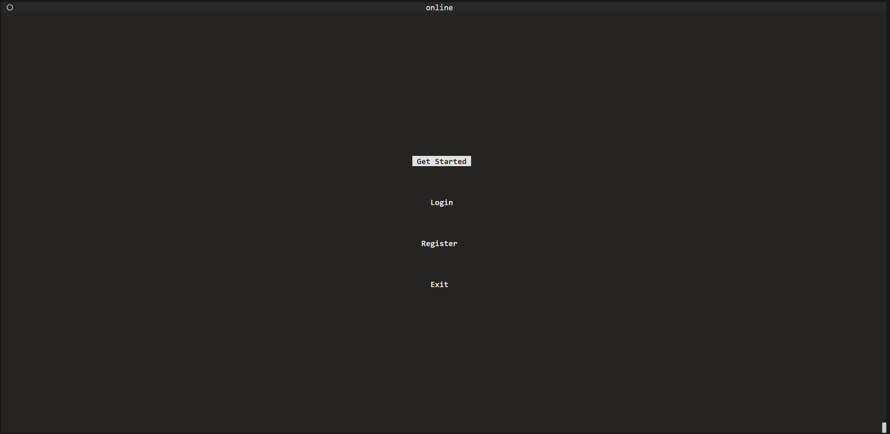
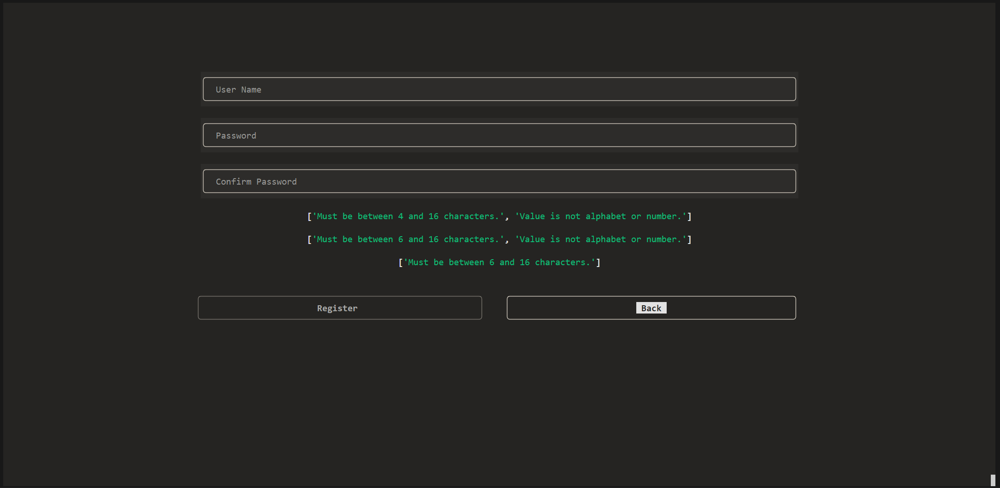
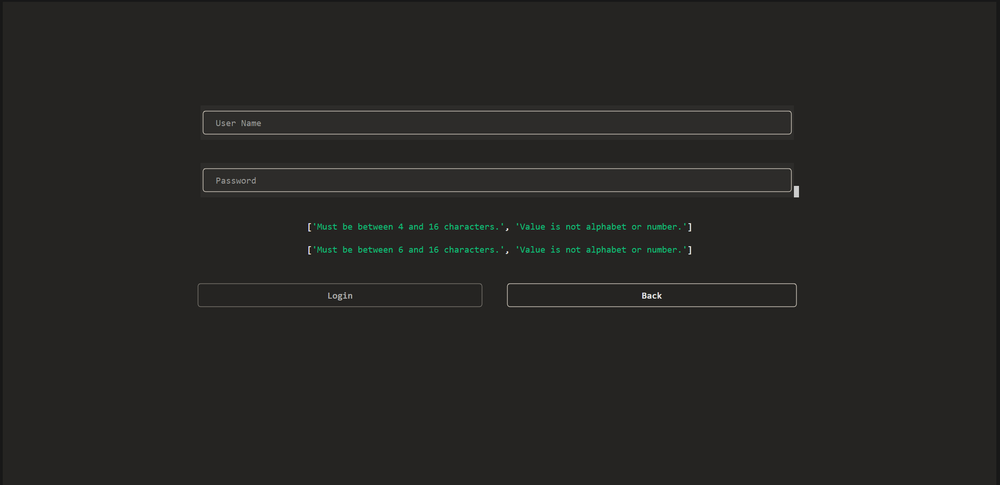
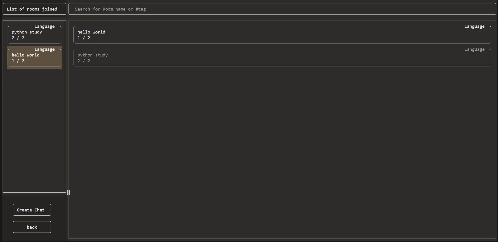
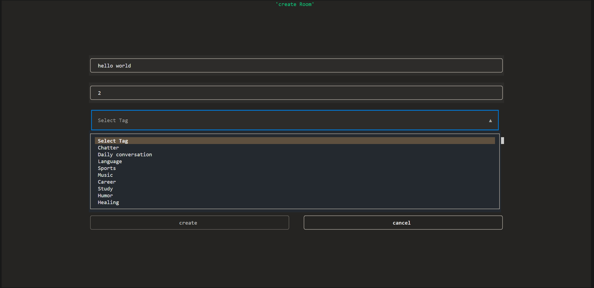
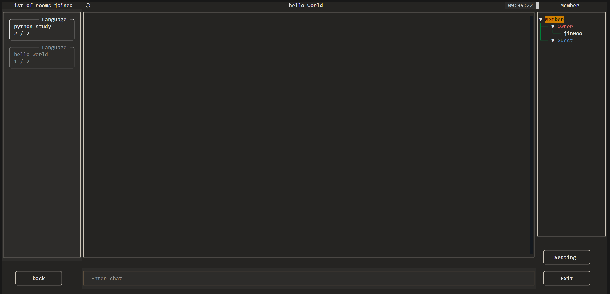

<h1 align="center">🙏 Jobdam - Terminal TUI open chatting APP  🙏</h1>

<h4 align="center">Enjoy simple open chatting in the terminal!</h4>

<p align="center"></img></center>

# Introduction

`Jobdam` is a Text User Interface (TUI) open chatting application designed for simple and hassle-free communication in the terminal. The name "Jobdam" means "chat, small talk, chitchat" in Korean, reflecting the app's purpose of facilitating casual conversations. The application features a straightforward UI, allowing users to engage in open chatting without the need for authentication or sign-up.


# 🛎 Current Version `0.1.6`

#### Upgrade with `pip install jobdam --upgrade`

# 🚀 Installation & Settings

- Requires Python version >3.11.
- Install using:

```bash
pip install jobdam
```

Note: Some shells may affect the UI, so it's recommended to use Jobdam on full-screen mode.

# 👨‍💻 Instructions

- The screen consists of various widgets. You can navigate conveniently with the TAB key and select a Room using the up and down arrow keys.
- Create a room by providing Room Name, Tag, and Maximum people (up to 10).
- Room owners can ban guests and adjust room settings.
- Each account can create up to three rooms.

# 📸 Screenshot
## Main

Navigate up and down using the `TAB` key and select with the `Enter` key.



## Register

Similar to the main screen, navigate with the `TAB` key. The green text in the center corresponds to the `validator` for each input field.


## Login

Similar to the register screen.


## Search Screen

- The left side shows the rooms you've joined, and the center lists rooms created by other users.
- The input field at the top center allows you to search for rooms by Room name or `#tag`.
	- e.g., `#Language`


## Create room Screen

Clicking the Create Room button on the search screen brings up the following screen.
- Set `Room Name`, `Tag`, and `Maximum people`, each with its own `validator`.



## Chat room Screen

- Left side: Rooms you've joined.
- Center: Chat history.
- Right side: People in the room; owners can ban guests.
- Bottom-left: Settings button for room owners.
- Bottom-right: Exit button for owners (deletes the room) or guests (exits the room).



# 💬 Remarks

When entering a room, a WebSocket connection is established, and the connection is immediately terminated upon exiting the app.

I wanted the WebSocket to persist for the duration of the access token's validity to send notifications. However, I have not yet found a way to maintain it with my limited knowledge.

I will strive to make this possible as quickly as possible.


# 🚮 Uninstalling

If, by any chance, due to unforeseen circumstances, you wish to uninstall, you can do so with the following command:

```bash
pip uninstall jobdam
```